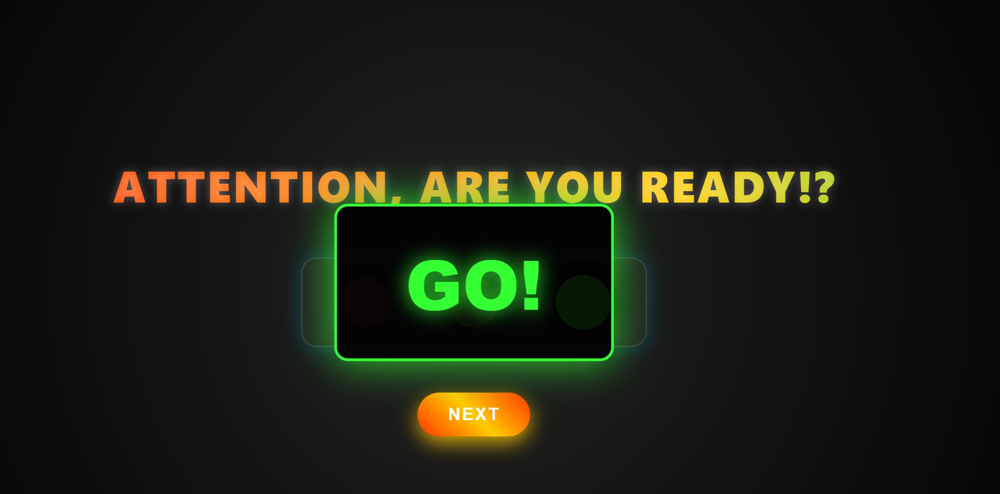

# 🚦 Гоночный светофор с анимацией

# Проект интерактивного светофора с эффектами в стиле Need for Speed, включая анимацию "GO!" 
# Светофор работает в автоматическом режиме, переключение через каждые три секунды.
## Дополнительно при нажатии кнопки NEXT меняется сигнал светофора.

## ✨ Особенности

- 🚗 Горизонтальный светофор с плавными переходами
- Красочный анимированный заголовок
- 💥 Эффект "GO!" при зеленом сигнале с:
  - Пульсирующей анимацией
  - Неоновым свечением
  
 

## 🛠 Технологии

- HTML5
- CSS3 (Flexbox, анимации, градиенты)
- JavaScript (логика переключения)

